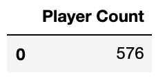
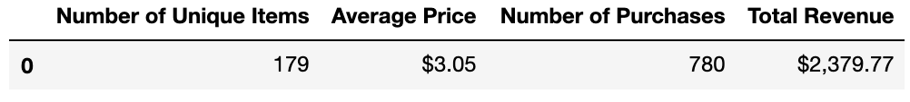
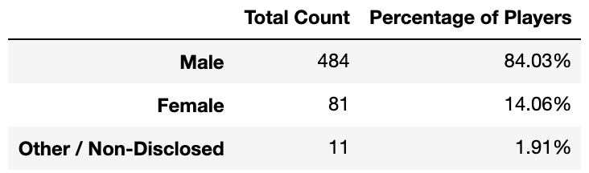
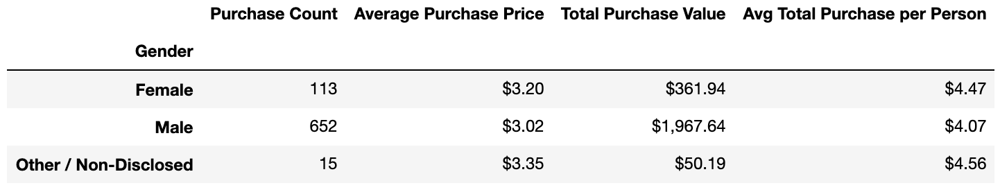
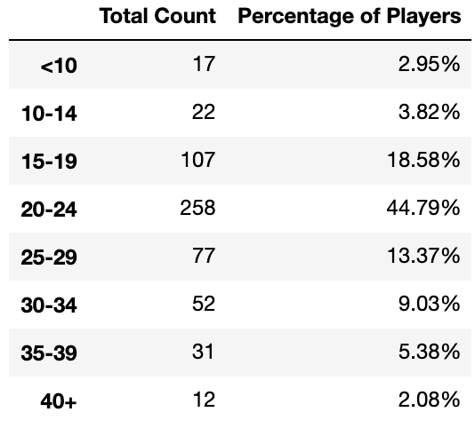
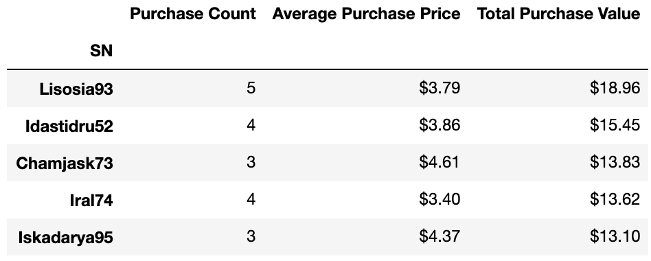
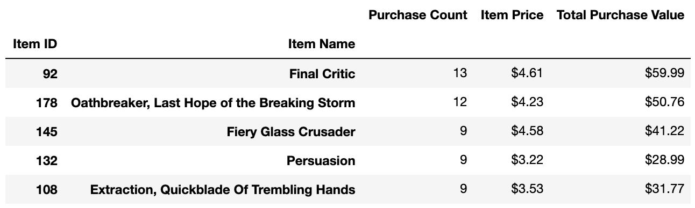
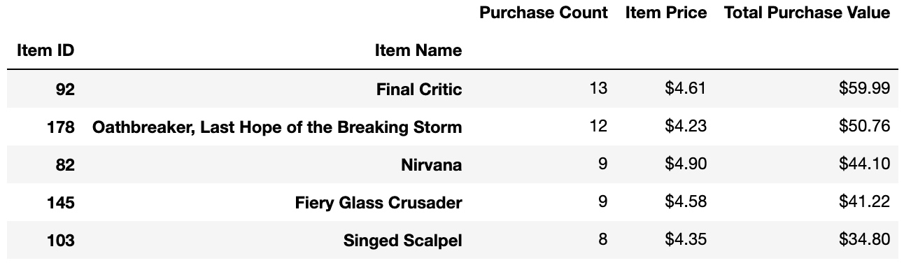

# Heroes of Pymoli Fantasy Game - Pandas Analysis

  

## Summary ##

This project uses Python Pandas to analyze data for a fantasy video game called Heroes of Pymoli. The game is free-to-play, like many others in its genre, but players are encouraged to purchase optional items that enhance their playing experience. Pandas allows for a breakdown of the game's purchasing data into meaningful insights. 

## Process ##

### Player Count

* Total Number of Players

  

### Purchasing Analysis (Total)

* Number of Unique Items
* Average Purchase Price
* Total Number of Purchases
* Total Revenue

  

### Gender Demographics

* Percentage and Count of Male Players
* Percentage and Count of Female Players
* Percentage and Count of Other / Non-Disclosed

  

### Purchasing Analysis (Gender)

* The below each broken by gender
  * Purchase Count
  * Average Purchase Price
  * Total Purchase Value
  * Average Purchase Total per Person by Gender

  

### Age Demographics

* The below each broken into bins of 4 years (i.e. &lt;10, 10-14, 15-19, etc.)
  * Purchase Count
  * Average Purchase Price
  * Total Purchase Value
  * Average Purchase Total per Person by Age Group

  

### Top Spenders

* Identify the the top 5 spenders in the game by total purchase value, then list (in a table):
  * SN
  * Purchase Count
  * Average Purchase Price
  * Total Purchase Value

  

### Most Popular Items

* Identify the 5 most popular items by purchase count, then list (in a table):
  * Item ID
  * Item Name
  * Purchase Count
  * Item Price
  * Total Purchase Value

  

### Most Profitable Items

* Identify the 5 most profitable items by total purchase value, then list (in a table):
  * Item ID
  * Item Name
  * Purchase Count
  * Item Price
  * Total Purchase Value

  

---

## Conclusions ##
A population of 576 unique players was analyzed here. The population is comprised of 84% males and 14% females. Within this population, males and females on average make purchases of similar amounts. The most populous age group falls between 20-24, at 44.8%, followed by 15-19 and 25-29, at 18.6% and 13.4%, respectively.

---

The most popular item was 'Final Critic', which was purchased 13 times, followed by 'Oathbreaker, Last Hope of the Breaking Storm', with 12 purchases. 
Those same two items were also the most profitable, at $59.99 and $50.76 in total purchase amounts respectively.

## Technologies Used ##
* Python - Pandas

---

## Author ##
Kiran Rangaraj - LinkedIn: [@Kiran Rangaraj](https://www.linkedin.com/in/kiranrangaraj/)
